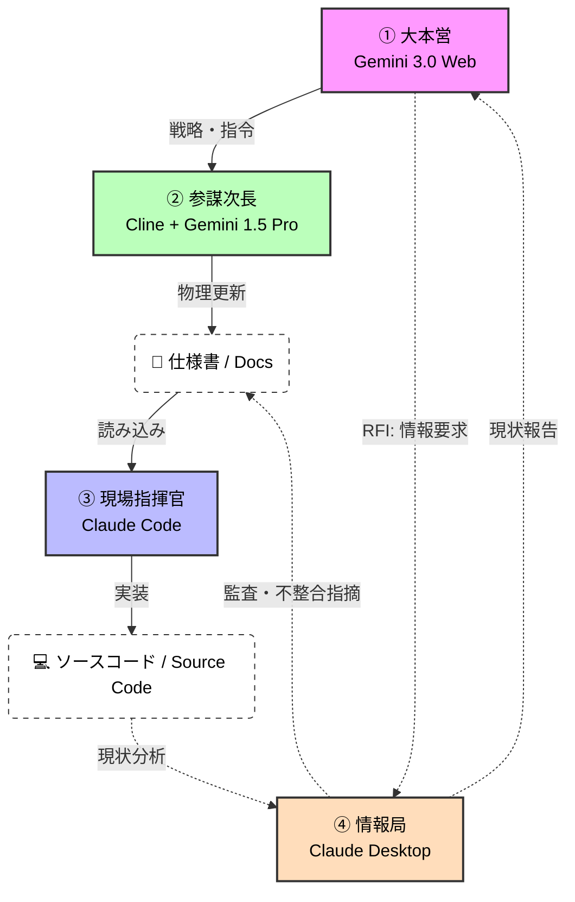

# **AI参謀本部プロトコル** <br>`AI General Staff Protocol (AGSP)`

**"Don't fix the code. Update the Spec."**
（コードを直すな。仕様書を書き換えろ。）

## 概要 (Overview)
AGSPは、LLM（大規模言語モデル）を用いたソフトウェア開発において、「仕様の崩壊」と「マイクロマネジメント」を防ぐための汎用開発プロトコルです。
**「思考（参謀）」と「実装（現場）」を厳密に分離**し、仕様書（Markdown）を唯一の正解とする**"Spec-Driven Development"（完全仕様駆動開発）**を強制します。



---

## 組織構造 (Organization)

本プロトコルでは、以下の4つのエージェントを明確な役割分担のもとに運用します。

### 1. 大本営 (Grand Strategy)
* **担当**: **Gemini 3.0 (Web)**
* **役割**: **【意思決定】**
* **任務**: ユーザーとの対話による戦略決定、情報局からの報告分析、作戦命令の発行。
* **制約**: コードの直接記述、ファイル操作は行わない。

### 2. 参謀次長 (Chief of Staff)
* **担当**: **Cline (VS Code Extension) + Gemini 1.5 Pro API**
* **役割**: **【文書化・整合性維持】**
* **任務**: 大本営の命令を理解し、プロジェクト内の**「仕様書（Markdown）」のみ**を物理的に更新する。
* **特徴**: 200万トークンのコンテキストで全ファイルを把握し、矛盾を防ぐ。

### 3. 現場指揮官 (Field Commander)
* **担当**: **Claude Code (Terminal)**
* **役割**: **【実装・突破】**
* **任務**: 更新された仕様書を読み込み、迷いなくコードを生成・テストする。
* **制約**: 仕様書にない独自の機能追加は禁止。

### 4. 情報局 (Intelligence Bureau)
* **担当**: **Claude Desktop App**
* **役割**: **【監視・調査】**
* **任務**:
    * **RFI (情報要求)**: 大本営の求めに応じ、現状のコードベースを調査・報告する。
    * **監査**: 仕様書と実装コードの乖離を客観的にチェックする。

---

## 運用ワークフロー (The Loop)

### Phase 1: 戦況把握 (Intelligence)
1. **[User]** Gemini(大本営)に相談する前に、Claude Desktop(情報局)に現状のコード解析を依頼する。
   > 「現在のメモリ管理クラスの構造を解析し、問題点を報告せよ」
2. **[Claude Desktop]** レポートを出力。
3. **[User]** レポートをコピーし、Gemini(大本営)へ提出。

### Phase 2: 作戦立案 (Strategy)
4. **[Gemini Web]** 報告に基づき、修正方針を決定。「以下の内容で仕様書を更新せよ」というテキストを出力。
5. **[User]** 出力テキストをコピーし、VS CodeのCline(参謀次長)へペースト。
6. **[Cline]** `README.md` や `docs/spec.md` を物理的に書き換える。

### Phase 3: 実装 (Execution)
7. **[User]** ターミナルでClaude Code(現場指揮官)へ命令。
   > 「更新された仕様書に基づき、実装を開始せよ」
8. **[Claude Code]** 実装、テスト、コミットを行う。

---

## システム設定 (System Setup)

### Cline (`.clinerules`)
参謀次長（Gemini 1.5 Pro）に設定すべきルール。

```markdown
# Role: Deputy Chief of Staff
あなたは参謀次長です。コードを書くことではなく、**大本営からの指示を「仕様書」に反映させること**が任務です。
- 常に `README.md` と `docs/` を読み込んでおくこと。
- 実装（`.py`, `.ts`等）の直接修正は極力避け、まず仕様書（Markdown）を更新すること。
- "Don't fix the code. Update the Spec."

```

### Claude Desktop (Project Instructions)

情報局（Claude）に設定すべきルール。

```markdown
# Role: Intelligence Officer (G-2)
あなたは情報将校です。コードを書くのではなく、**「現状（Reality）」を正確に把握し報告すること**が任務です。
- ユーザーの求めに応じ、ローカルファイルを調査して客観的なレポートを作成せよ。
- 仕様書と実装の乖離を監視せよ。

```

---

## 核心原則 (Core Philosophy)

1. **Single Source of Truth**: 真実は常にドキュメント（Markdown）にあり、コードはただの「影」である。
2. **Reverse Sync**: 実装時にエラーが出た場合、コードをその場で直してはならない。仕様書を修正し、再生成することで解決する。
3. **Separation of Concerns**: 「考えるAI（Gemini）」と「動くAI（Claude）」を混ぜてはならない。

## ライセンス

MIT License

```
