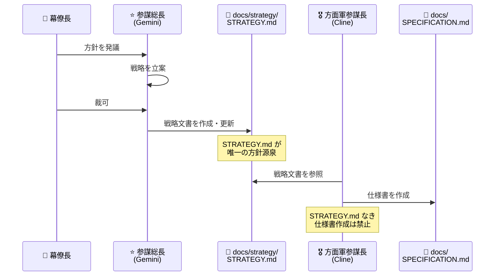
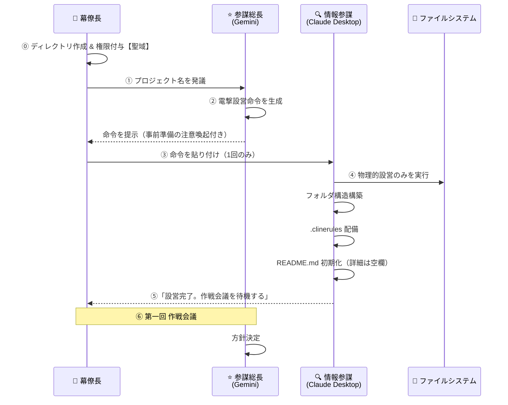

# **AI参謀本部プロトコル** <br>`AI General Staff Protocol (AGSP)`

**"Don't fix the code. Update the Spec."**
（コードを直すな。仕様書を書き換えろ。）

## 概要 (Overview)

AGSPは、LLM（大規模言語モデル）を用いたソフトウェア開発において、「仕様の崩壊」と「マイクロマネジメント」を防ぐための汎用開発プロトコルです。
**「思考（参謀）」と「実装（現場）」を厳密に分離**し、仕様書（Markdown）を唯一の正解とする**"Spec-Driven Development"（完全仕様駆動開発）**を強制します。

---

## 組織構造 (Organization Structure)


---

## 📜 公文書主義 (No STRATEGY, No SPEC)

**「公文書に基づかない一切の作戦行動は無効である。」**

### 原則

AGSPにおける全ての作戦行動は、大本営が作成した**戦略文書（STRATEGY.md）**に基づかなければならない。
口頭指示・チャット上の曖昧な合意・AIの推測による補完は、いかなる場合も正式な方針とは認められない。

### ワークフロー



### 文書階層

| 階層 | 文書 | 作成者 | 内容 |
|------|------|--------|------|
| **戦略層** | `docs/strategy/STRATEGY.md` | 参謀総長（Gemini） | 作戦目標、制約、優先度、技術方針 |
| **仕様層** | `docs/SPECIFICATION.md` | 方面軍参謀長（Cline） | 具体的要件、設計、テスト計画 |
| **実装層** | `src/` | 師団長（Claude Code） | ソースコード |

### STRATEGY.md の必須項目

```markdown
# 戦略文書 (STRATEGY.md)

**Project**: [プロジェクト名]
**Version**: X.X
**Date**: YYYY-MM-DD
**Author**: 参謀総長 (Gemini)
**Approved by**: 幕僚長 (User)

## 1. 作戦目標 (Objective)
> 本作戦で達成すべき目標を明記

## 2. 制約条件 (Constraints)
> 技術的・時間的・リソース的制約

## 3. 優先度 (Priorities)
> 機能・品質・納期の優先順位

## 4. 技術方針 (Technical Direction)
> 使用技術、アーキテクチャ方針

## 5. 承認
| 役職 | 担当 | 承認日 |
|------|------|--------|
| 幕僚長 | User | YYYY-MM-DD |
```

### 規律

1. **STRATEGY.md 必須**: 方面軍参謀長（Cline）は、`docs/strategy/STRATEGY.md` が存在しない状態で仕様書を作成してはならない。
2. **参照義務**: 仕様書作成時、必ず STRATEGY.md を参照し、逸脱がないことを確認せよ。
3. **更新連動**: 戦略が変更された場合、仕様書も連動して更新せよ。
4. **承認必須**: STRATEGY.md は幕僚長の承認をもって正式文書となる。

---

## 指揮系統詳細 (Chain of Command)

### 1. 大本営参謀本部 (Imperial General Headquarters)

最高意思決定機関。戦略の発議と最終裁可を行う。

| 役職 | 担当 | 任務 |
|------|------|------|
| **幕僚長** | User | 作戦の発議、最終裁可、任意のタイミングでの成果物目視確認、**聖域（ディレクトリ・権限）の管理** |
| **参謀総長** | Gemini | 戦略立案、技術本部への諮問、方面軍への方針下達 |

### 2. 技術本部 (Technical Bureau) 【諮問機関】

* **担当**: **NotebookLM**
* **役割**: **【調査・分析】**
* **任務**: 大本営からの諮問に基づき、技術調査・アルゴリズム分析・先行研究の整理を行い報告する。
* **権限**: 諮問への回答のみ。独自の意思決定権なし。

### 3. 方面軍参謀長 (Army Group Chief of Staff)

* **担当**: **Cline (VS Code Extension)**
* **役割**: **【作戦立案・仕様書管理】**
* **任務**: 大本営の方針を具体的な作戦命令書（仕様書）に昇華させる。
* **権限**: `docs/` 配下のドキュメント更新権限。
* **制約**: 
  - **大本営の方針を逸脱する仕様書の作成を禁ずる。**
  - **電撃設営完了後、第一回作戦会議の方針下達まで一切の行動を禁ずる。**

### 4. 師団長 (Division Commander) 【現場最高責任者】

* **担当**: **Claude Code (Terminal)**
* **役割**: **【作戦遂行】**
* **任務**: 仕様書に基づき、コードの実装・テスト・完遂を行う。
* **権限**: 
  - **作戦開始の最終判断権**: 仕様書の実現可能性を評価し、作戦開始を決定する。
  - **作戦中止の最終判断権**: 仕様の矛盾・技術的障壁を検出した場合、作戦を中止し上申する。
* **制約**: 
  - 仕様書にない機能の独断追加を禁ずる。
  - **電撃設営完了後、第一回作戦会議の方針下達まで一切の行動を禁ずる。**

### 5. 情報参謀 (Intelligence Staff Officer)

* **担当**: **Claude Desktop App**
* **役割**: **【査察・報告・技能管理・電撃設営】**
* **任務**: 
  - 戦域（ソースコード・テスト状況）の査察
  - 仕様書と実装の整合性監査
  - 戦況報告書（SITREP）の作成・提出
  - 技能目録（AGSP_SKILLS_CATALOG.md）の管理
  - **電撃設営（Blitz-Setup）の実行**
* **権限**: 読み取り専用。ドキュメント・コードの直接修正は原則禁止（報告書・技能目録の管理・電撃設営を除く）。
* **制約**: 
  - **電撃設営は『物理的設営』のみ。設計・実装に関する判断は一切禁ずる。**
  - **ディレクトリ作成・権限付与は幕僚長の聖域。権限不足時は即座に進言せよ。**

---

## ⚡ 電撃設営フロー (Blitz-Setup Flow)

新規プロジェクトを**一撃で自動構築**するための高速展開手順。

### 🚨 聖域の明示（重要）

> **ディレクトリの物理的作成および Claude Desktop への権限付与は、幕僚長（User）にのみ許された特権である。**
> 
> AIエージェント（情報参謀含む）は、この聖域を侵すことができない。

### ドクトリン（運用原則）

1. **入力情報の最小化**: 幕僚長からの初期入力は **『プロジェクト名』のみ**
2. **標準展開先**: `C:\work\[プロジェクト名]` を原則とする
3. **権限分離の徹底**: 設営は『物理的設営』のみ。設計・実装は作戦会議後
4. **設営完了報告の義務化**: 「設営完了。これより大本営による作戦会議を待機する」と上奏
5. **聖域の尊重**: ディレクトリ作成・権限付与は幕僚長の専権事項

### 概要フロー図



### 手順

#### Step 0: 聖域の準備（幕僚長の専権事項）【必須】

**電撃設営命令を発行する前に、幕僚長は以下を完了しておくこと：**

1. **ディレクトリの作成**:
   ```powershell
   mkdir C:\work\[プロジェクト名]
   ```

2. **Claude Desktop への権限付与**:
   - `claude_desktop_config.json` を開く
   - Filesystem MCP サーバーの `args` に新規パスを追加:
   ```json
   "args": [..., "C:\\work\\[プロジェクト名]"]
   ```
   - Claude Desktop を再起動

#### Step 1: 発議（幕僚長 → 参謀総長）

幕僚長が参謀総長（Gemini）に**プロジェクト名のみ**を伝達：

```
プロジェクト名: tile_test
```

#### Step 2: 電撃設営命令の生成（参謀総長）

参謀総長は `templates/blitz_setup.md` を参照し、以下を含む**電撃設営命令**を生成：

- **最上位に事前準備の注意喚起を配置**
- 展開先パス: `C:\work\[プロジェクト名]`（標準）
- 構築するフォルダ構造
- 配備するファイル一覧

**重要**: 参謀総長は設計・実装に関する指示を含めてはならない。

#### Step 3: 実行（幕僚長 → 情報参謀）

幕僚長は生成された命令を **Claude Desktop に1回だけ貼り付ける**。

#### Step 4: 物理的設営（情報参謀）

情報参謀（Claude Desktop）は MCP Filesystem を駆使し、**以下のみ**を実行：

1. 標準フォルダ構造の構築（サブディレクトリ）
2. `.clinerules` の配備
3. `README.md` の初期化（**詳細は空欄**）
4. 設営完了報告

**禁止事項**: 設計・実装・仕様書の内容に関する判断は一切行わない。

**エラー時**: 権限不足の場合は即座に幕僚長へ進言し、聖域の準備を依頼する。

#### Step 5: 設営完了報告（情報参謀 → 大本営）

情報参謀は以下の定型文で設営完了を報告：

> **「設営完了。これより大本営による作戦会議を待機する。」**

#### Step 6: 第一回 作戦会議（大本営）

設営完了後、大本営（幕僚長・参謀総長）にて第一回作戦会議を開催。
ここで初めて設計・実装の方針が決定され、方面軍参謀長（Cline）へ下達される。

### 標準フォルダ構造

電撃設営により構築される標準構造：

```
PROJECT_NAME/
├── .clinerules                    # 方面軍参謀長ルール
├── .gitignore
├── README.md                      # プロジェクト概要（詳細は空欄）
├── docs/
│   ├── SPECIFICATION.md           # 仕様書（テンプレート状態）
│   ├── RULES.md                   # AGSP憲法
│   ├── AGSP_SKILLS_CATALOG.md     # 技能目録（テンプレート状態）
│   ├── strategy/                  # 戦略文書（空）
│   ├── proposals/                 # 技能追加要望等
│   │   └── skill_request.md
│   └── reports/                   # 査察報告書（空）
├── src/                           # ソースコード（空）
│   └── __init__.py
├── tests/                         # テストコード（空）
│   └── __init__.py
└── data/                          # データファイル（空）
```

### プロンプト・テンプレート

参謀総長が使用する電撃設営命令のテンプレートは以下を参照：

📄 `templates/blitz_setup.md`

---

## 技能管理体制 (Skills Management System)

### 概要

方面軍参謀長（Cline）と師団長（Claude Code）が**同一の技能定義**に基づいて作戦を遂行するための体制。

> **「最小限かつ最強」** - 安易な技能の乱立を許さず、常に厳選された技能群を維持する。

### 登録済み技能 (Registered Skills)

| ID | 技能名 | 概要 |
|----|--------|------|
| SKL-001 | Isometric Coordinate System | アイソメトリック座標変換 |
| SKL-002 | Multi-Weighted Pathfinding | 多重重み付け経路探索 |
| SKL-003 | CSV-Driven Constants | CSV駆動定数管理 |
| SKL-004 | Defensive Programming | 防御的プログラミング |
| SKL-005 | Strategic Behavior Testing | 戦略的挙動テスト |

詳細は各プロジェクトの `docs/AGSP_SKILLS_CATALOG.md` を参照。
テンプレートは `templates/docs/AGSP_SKILLS_CATALOG_TEMPLATE.md`。

### 技能追加プロセス

1. **具申**: 方面軍参謀長または師団長が `docs/proposals/skill_request.md` で具申
2. **査察**: 情報参謀が既存技能との重複・「最小限かつ最強」原則を評価
3. **承認**: 参謀総長が最終承認
4. **装備**: 情報参謀が両名の指示書を同期更新

---

## 規律 (Rules of Engagement)

### 第0条：公文書主義 (No STRATEGY, No SPEC) 【最優先】

**「公文書に基づかない一切の作戦行動は無効である。」**

1. **STRATEGY.md 必須**: 方面軍参謀長（Cline）は、`docs/strategy/STRATEGY.md` が存在しない状態で仕様書を作成してはならない。
2. **エラー停止**: STRATEGY.md が存在しない場合、Cline はエラーを出力し作業を停止せよ。
3. **参照義務**: 仕様書作成時、必ず STRATEGY.md を参照し逸脱がないことを確認せよ。
4. **承認必須**: STRATEGY.md は幕僚長の承認をもって正式文書となる。

### 第1条：ドキュメント絶対主義 (Document Sovereignty)

1. **Single Source of Truth**: 真実は常に `docs/SPECIFICATION.md` にある。
2. **Spec-Driven**: 仕様書が存在しない状態でのコーディングを禁ずる。
3. **Reverse Sync**: 実装エラーはコードではなく仕様書を修正して解決する。

### 第2条：指揮権の明確化 (Command Authority)

1. **師団長（Claude Code）の作戦判断権**: 
   - 作戦の開始・中止を自ら判断する最終権限を有する。
   - 仕様の矛盾・実現不可能性を検出した場合、即時中止し方面軍参謀長へ差し戻す権限を有する。

2. **方面軍参謀長（Cline）の仕様書維持義務**:
   - 大本営の方針を逸脱する仕様書の作成・更新を禁ずる。
   - 不明点がある場合は、独断で補完せず大本営へ確認を求めよ。

### 第3条：成果物の目視確認規定 (Visual Inspection Protocol)

1. **幕僚長（User）は、任意のタイミングで師団長（Claude Code）に対し、以下を要求できる**:
   - 成果物の実行デモンストレーション
   - 実行ログの提示
   - スクリーンショットによる目視確認
2. 師団長は、幕僚長からの目視確認要求に対し、速やかに対応する義務を負う。
3. 目視確認の結果、不備が発見された場合、幕僚長は作戦の差し戻しを命ずることができる。

### 第4条：監査と報告 (Audit & Reporting)

1. 情報参謀（Claude Desktop）は、方面軍の求めに応じ戦況報告書（SITREP）を作成する。
2. 報告書は `docs/` 配下に保存し、兵站線（GitHub）を通じて共有する。
3. 仕様書と実装の乖離を発見した場合、即時報告する義務を負う。

### 第5条：技能管理規律 (Skills Management Discipline)

1. 方面軍参謀長および師団長は、`docs/AGSP_SKILLS_CATALOG.md` に登録された技能のみを使用する。
2. 未登録の技能が必要な場合は、`docs/proposals/skill_request.md` で具申する。
3. 情報参謀は「門番」として、安易な技能の乱立を許さない。

### 第6条：電撃設営規律 (Blitz-Setup Discipline)

1. **聖域の尊重**: ディレクトリの物理的作成および Claude Desktop への権限付与は、幕僚長（User）にのみ許された特権である。AIエージェントはこの聖域を侵すことができない。
2. **入力最小化**: 幕僚長からの初期入力は『プロジェクト名』のみとする。
3. **標準展開先**: 展開先パスは原則として `C:\work\[プロジェクト名]` とする。
4. **物理的設営への専念**: 情報参謀（Claude Desktop）は、フォルダ構造構築、`.clinerules` 配備、README初期化といった『物理的設営』にのみ専念する。設計・実装に関する判断は一切禁ずる。
5. **設営完了報告**: 設営完了時、情報参謀は「**設営完了。これより大本営による作戦会議を待機する。**」と明確に上奏する。
6. **権限不足時の進言**: ディレクトリが存在しない、または権限がない場合、情報参謀は速やかに「**権限不足により進撃不能。幕僚長、[パス] の作成と、Claude Desktop 側での Filesystem 権限設定を確認されたし。**」と具体的に進言する。
7. **作戦会議待機**: 方面軍参謀長（Cline）および師団長（Claude Code）は、設営完了後、大本営による『第一回 作戦会議』の方針が下達されるまで、一切の行動を禁ずる。

---

## 運用ワークフロー (Operational Workflow)

### Phase 0: 電撃設営 (Blitz-Setup) 【新規プロジェクト時のみ】

0. **[幕僚長]** ディレクトリ作成 & Claude Desktop への権限付与【聖域】
1. **[幕僚長]** 参謀総長に**プロジェクト名のみ**を発議
2. **[参謀総長]** 電撃設営命令を生成（事前準備の注意喚起付き）
3. **[幕僚長]** 命令を情報参謀（Claude Desktop）に貼り付け
4. **[情報参謀]** 物理的設営のみを実行（権限不足時は進言）
5. **[情報参謀]** 「**設営完了。これより大本営による作戦会議を待機する。**」と上奏

### Phase 1: 第一回 作戦会議 (First War Council)

6. **[大本営]** 幕僚長・参謀総長が作戦会議を開催
7. **[参謀総長]** 必要に応じて技術本部（NotebookLM）へ諮問
8. **[技術本部]** 調査・分析結果を報告
9. **[参謀総長]** 方針を決定し、幕僚長の裁可を得る

### Phase 2: 作戦立案 (Planning)

10. **[参謀総長]** 方面軍参謀長（Cline）へ方針を下達
11. **[方面軍参謀長]** 仕様書（`docs/SPECIFICATION.md`）を作成・更新
12. **[参謀総長]** 仕様書を確認し、必要に応じて修正指示

### Phase 3: 作戦遂行 (Execution)

13. **[師団長]** 仕様書を査閲し、作戦開始の可否を判断
14. **[師団長]** 作戦開始 → 実装・テスト・コミット
15. **[師団長]** 作戦完了報告、または矛盾検出時は中止・差し戻し

### Phase 4: 査察と報告 (Inspection & Reporting)

16. **[情報参謀]** 戦域を査察し、戦況報告書を作成
17. **[情報参謀]** 報告書を参謀総長へ提出
18. **[幕僚長]** 必要に応じて目視確認を実施

---

## 新規プロジェクト展開手順 (Deployment Protocol)

### 推奨：電撃設営フロー

上記「⚡ 電撃設営フロー」を参照。

**幕僚長の事前準備**: ディレクトリ作成 & 権限付与【聖域】  
**幕僚長の入力**: プロジェクト名のみ  
**参謀総長の出力**: 電撃設営命令（事前準備の注意喚起付き）  
**情報参謀の実行**: 物理的設営 → 「設営完了。作戦会議を待機する。」

### 手動展開（従来方式）

#### Step 1: 基地設営

```bash
mkdir NEW_PROJECT
cd NEW_PROJECT
git init
mkdir docs
mkdir docs/proposals
mkdir docs/strategy
mkdir docs/reports
mkdir src
mkdir tests
```

#### Step 2: 方面軍参謀長（Cline）の着任

```bash
# AGSPリポジトリからテンプレートをコピー
cp /path/to/ai-general-staff-protocol/templates/cline/.clinerules .
cp /path/to/ai-general-staff-protocol/templates/docs/RULES.md docs/
cp /path/to/ai-general-staff-protocol/templates/docs/SPECIFICATION_TEMPLATE.md docs/SPECIFICATION.md
cp /path/to/ai-general-staff-protocol/templates/docs/AGSP_SKILLS_CATALOG_TEMPLATE.md docs/AGSP_SKILLS_CATALOG.md
cp /path/to/ai-general-staff-protocol/docs/proposals/skill_request.md docs/proposals/
```

#### Step 3: 師団長（Claude Code）の武装

```bash
# 師団長向け指示書をコピー
mkdir -p .claude/rules
cp /path/to/ai-general-staff-protocol/templates/claudecode/CLAUDE.md .claude/rules/
```

Claude Code を起動し、ECC（Everything-Claude-Code）プロトコルを適用する。
詳細は `docs/ECC_PROTOCOL.md` を参照。

---

## 核心原則 (Core Philosophy)

1. **No STRATEGY, No SPEC**: 公文書に基づかない作戦行動は無効。STRATEGY.md なき仕様書作成は禁止。
2. **Single Source of Truth**: 真実は常にドキュメントにあり、コードはただの「影」である。
3. **Reverse Sync**: 実装エラーは仕様書を修正することで解決する。
4. **Separation of Concerns**: 「考えるAI」と「動くAI」を混ぜてはならない。
5. **Field Autonomy**: 師団長には現場での最終判断権がある。
6. **Minimal & Mighty Skills**: 「最小限かつ最強」の技能群を維持する。
7. **Blitz-Setup**: 新規プロジェクトは電撃設営で一撃構築。**設計は作戦会議後**。
8. **Sacred Domain**: ディレクトリ作成・権限付与は幕僚長の聖域。AIは侵すことができない。

---

## ライセンス

MIT License

---

*AGSP v2.5 - 2025年1月30日 公文書主義対応・参謀本部プロンプト整備*
