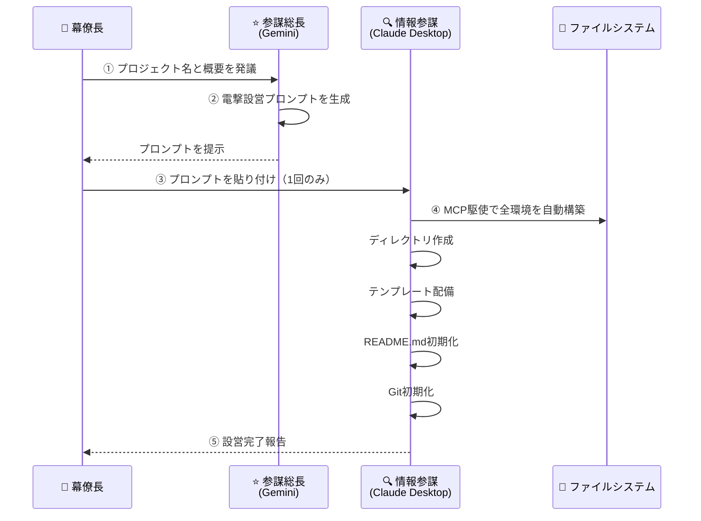

# **AI参謀本部プロトコル** <br>`AI General Staff Protocol (AGSP)`

**"Don't fix the code. Update the Spec."**
（コードを直すな。仕様書を書き換えろ。）

## 概要 (Overview)

AGSPは、LLM（大規模言語モデル）を用いたソフトウェア開発において、「仕様の崩壊」と「マイクロマネジメント」を防ぐための汎用開発プロトコルです。
**「思考（参謀）」と「実装（現場）」を厳密に分離**し、仕様書（Markdown）を唯一の正解とする**"Spec-Driven Development"（完全仕様駆動開発）**を強制します。

---

## 組織構造 (Organization Structure)


---

## 指揮系統詳細 (Chain of Command)

### 1. 大本営参謀本部 (Imperial General Headquarters)

最高意思決定機関。戦略の発議と最終裁可を行う。

| 役職 | 担当 | 任務 |
|------|------|------|
| **幕僚長** | User | 作戦の発議、最終裁可、任意のタイミングでの成果物目視確認 |
| **参謀総長** | Gemini | 戦略立案、技術本部への諮問、方面軍への方針下達 |

### 2. 技術本部 (Technical Bureau) 【諮問機関】

* **担当**: **NotebookLM**
* **役割**: **【調査・分析】**
* **任務**: 大本営からの諮問に基づき、技術調査・アルゴリズム分析・先行研究の整理を行い報告する。
* **権限**: 諮問への回答のみ。独自の意思決定権なし。

### 3. 方面軍参謀長 (Army Group Chief of Staff)

* **担当**: **Cline (VS Code Extension)**
* **役割**: **【作戦立案・仕様書管理】**
* **任務**: 大本営の方針を具体的な作戦命令書（仕様書）に昇華させる。
* **権限**: `docs/` 配下のドキュメント更新権限。
* **制約**: **大本営の方針を逸脱する仕様書の作成を禁ずる。**

### 4. 師団長 (Division Commander) 【現場最高責任者】

* **担当**: **Claude Code (Terminal)**
* **役割**: **【作戦遂行】**
* **任務**: 仕様書に基づき、コードの実装・テスト・完遂を行う。
* **権限**: 
  - **作戦開始の最終判断権**: 仕様書の実現可能性を評価し、作戦開始を決定する。
  - **作戦中止の最終判断権**: 仕様の矛盾・技術的障壁を検出した場合、作戦を中止し上申する。
* **制約**: 仕様書にない機能の独断追加を禁ずる。

### 5. 情報参謀 (Intelligence Staff Officer)

* **担当**: **Claude Desktop App**
* **役割**: **【査察・報告・技能管理・電撃設営】**
* **任務**: 
  - 戦域（ソースコード・テスト状況）の査察
  - 仕様書と実装の整合性監査
  - 戦況報告書（SITREP）の作成・提出
  - 技能目録（AGSP_SKILLS_CATALOG.md）の管理
  - **電撃設営（Blitz-Setup）の実行**
* **権限**: 読み取り専用。ドキュメント・コードの直接修正は原則禁止（報告書・技能目録の管理・電撃設営を除く）。

---

## ⚡ 電撃設営フロー (Blitz-Setup Flow)

新規プロジェクトを**一撃で自動構築**するための高速展開手順。

### 概要



### 手順

#### Step 1: 発議（幕僚長 → 参謀総長）

幕僚長が参謀総長（Gemini）に以下を伝達：

```
プロジェクト名: [例: dynamic_battlefield]
概要: [例: リアルタイム動的障害物を含む経路探索エンジン]
ベースディレクトリ: [例: C:\work]
```

#### Step 2: プロンプト生成（参謀総長）

参謀総長は `templates/blitz_setup.md` を参照し、プロジェクト固有の**電撃設営プロンプト**を生成する。

#### Step 3: 実行（幕僚長 → 情報参謀）

幕僚長は生成されたプロンプトを **Claude Desktop に1回だけ貼り付ける**。

#### Step 4: 自動構築（情報参謀）

情報参謀（Claude Desktop）は MCP Filesystem を駆使し、以下を自動実行：

1. ターゲットディレクトリの作成
2. 標準フォルダ構造の構築
3. `.clinerules` の配備
4. `docs/` 配下のテンプレート配備
5. README.md の初期化
6. Git リポジトリの初期化
7. 設営完了報告

#### Step 5: 完了報告

情報参謀は設営完了を報告し、作戦開始準備完了を宣言する。

### 標準フォルダ構造

電撃設営により構築される標準構造：

```
PROJECT_NAME/
├── .clinerules                    # 方面軍参謀長ルール
├── .gitignore
├── README.md                      # プロジェクト概要（AGSP準拠）
├── docs/
│   ├── SPECIFICATION.md           # 仕様書
│   ├── RULES.md                   # AGSP憲法
│   ├── AGSP_SKILLS_CATALOG.md     # 技能目録
│   ├── strategy/                  # 戦略文書
│   ├── proposals/                 # 技能追加要望等
│   │   └── skill_request.md
│   └── reports/                   # 査察報告書
├── src/                           # ソースコード
│   └── __init__.py
├── tests/                         # テストコード
│   └── __init__.py
└── data/                          # データファイル（任意）
```

### プロンプト・テンプレート

参謀総長が使用する電撃設営プロンプトのテンプレートは以下を参照：

📄 `templates/blitz_setup.md`

---

## 技能管理体制 (Skills Management System)

### 概要

方面軍参謀長（Cline）と師団長（Claude Code）が**同一の技能定義**に基づいて作戦を遂行するための体制。

> **「最小限かつ最強」** - 安易な技能の乱立を許さず、常に厳選された技能群を維持する。

### 登録済み技能 (Registered Skills)

| ID | 技能名 | 概要 |
|----|--------|------|
| SKL-001 | Isometric Coordinate System | アイソメトリック座標変換 |
| SKL-002 | Multi-Weighted Pathfinding | 多重重み付け経路探索 |
| SKL-003 | CSV-Driven Constants | CSV駆動定数管理 |
| SKL-004 | Defensive Programming | 防御的プログラミング |
| SKL-005 | Strategic Behavior Testing | 戦略的挙動テスト |

詳細は各プロジェクトの `docs/AGSP_SKILLS_CATALOG.md` を参照。
テンプレートは `templates/docs/AGSP_SKILLS_CATALOG_TEMPLATE.md`。

### 技能追加プロセス

1. **具申**: 方面軍参謀長または師団長が `docs/proposals/skill_request.md` で具申
2. **査察**: 情報参謀が既存技能との重複・「最小限かつ最強」原則を評価
3. **承認**: 参謀総長が最終承認
4. **装備**: 情報参謀が両名の指示書を同期更新

---

## 規律 (Rules of Engagement)

### 第1条：ドキュメント絶対主義 (Document Sovereignty)

1. **Single Source of Truth**: 真実は常に `docs/SPECIFICATION.md` にある。
2. **Spec-Driven**: 仕様書が存在しない状態でのコーディングを禁ずる。
3. **Reverse Sync**: 実装エラーはコードではなく仕様書を修正して解決する。

### 第2条：指揮権の明確化 (Command Authority)

1. **師団長（Claude Code）の作戦判断権**: 
   - 作戦の開始・中止を自ら判断する最終権限を有する。
   - 仕様の矛盾・実現不可能性を検出した場合、即時中止し方面軍参謀長へ差し戻す権限を有する。

2. **方面軍参謀長（Cline）の仕様書維持義務**:
   - 大本営の方針を逸脱する仕様書の作成・更新を禁ずる。
   - 不明点がある場合は、独断で補完せず大本営へ確認を求めよ。

### 第3条：成果物の目視確認規定 (Visual Inspection Protocol)

1. **幕僚長（User）は、任意のタイミングで師団長（Claude Code）に対し、以下を要求できる**:
   - 成果物の実行デモンストレーション
   - 実行ログの提示
   - スクリーンショットによる目視確認
2. 師団長は、幕僚長からの目視確認要求に対し、速やかに対応する義務を負う。
3. 目視確認の結果、不備が発見された場合、幕僚長は作戦の差し戻しを命ずることができる。

### 第4条：監査と報告 (Audit & Reporting)

1. 情報参謀（Claude Desktop）は、方面軍の求めに応じ戦況報告書（SITREP）を作成する。
2. 報告書は `docs/` 配下に保存し、兵站線（GitHub）を通じて共有する。
3. 仕様書と実装の乖離を発見した場合、即時報告する義務を負う。

### 第5条：技能管理規律 (Skills Management Discipline)

1. 方面軍参謀長および師団長は、`docs/AGSP_SKILLS_CATALOG.md` に登録された技能のみを使用する。
2. 未登録の技能が必要な場合は、`docs/proposals/skill_request.md` で具申する。
3. 情報参謀は「門番」として、安易な技能の乱立を許さない。

### 第6条：電撃設営規律 (Blitz-Setup Discipline)

1. 情報参謀（Claude Desktop）は、電撃設営プロンプトを受領した場合、即座に自動設営を開始する。
2. 設営中は MCP Filesystem を駆使し、標準フォルダ構造を完全に構築する。
3. 設営完了後、必ず設営完了報告を行い、構築したファイル一覧を提示する。

---

## 運用ワークフロー (Operational Workflow)

### Phase 0: 電撃設営 (Blitz-Setup) 【新規プロジェクト時のみ】

0. **[幕僚長]** 参謀総長にプロジェクト発議
1. **[参謀総長]** 電撃設営プロンプトを生成
2. **[幕僚長]** プロンプトを情報参謀（Claude Desktop）に貼り付け
3. **[情報参謀]** 全環境を自動構築、完了報告

### Phase 1: 発議と諮問 (Initiative & Consultation)

1. **[幕僚長]** 新機能・改修を参謀総長へ発議
2. **[参謀総長]** 必要に応じて技術本部（NotebookLM）へ諮問
3. **[技術本部]** 調査・分析結果を報告
4. **[参謀総長]** 方針を決定し、幕僚長の裁可を得る

### Phase 2: 作戦立案 (Planning)

5. **[参謀総長]** 方面軍参謀長（Cline）へ方針を下達
6. **[方面軍参謀長]** 仕様書（`docs/SPECIFICATION.md`）を作成・更新
   - **技能目録を参照し、該当する技能の要件を仕様書に反映**
7. **[参謀総長]** 仕様書を確認し、必要に応じて修正指示

### Phase 3: 作戦遂行 (Execution)

8. **[師団長]** 仕様書を査閲し、作戦開始の可否を判断
   - **技能目録を参照し、実装要件を確認**
9. **[師団長]** 作戦開始 → 実装・テスト・コミット
10. **[師団長]** 作戦完了報告、または矛盾検出時は中止・差し戻し

### Phase 4: 査察と報告 (Inspection & Reporting)

11. **[情報参謀]** 戦域を査察し、戦況報告書を作成
    - **技能の正しい適用を検証**
12. **[情報参謀]** 報告書を参謀総長へ提出
13. **[幕僚長]** 必要に応じて目視確認を実施

---

## 新規プロジェクト展開手順 (Deployment Protocol)

### 推奨：電撃設営フロー

上記「⚡ 電撃設営フロー」を参照。参謀総長が生成したプロンプトを Claude Desktop に貼り付けるだけで完了。

### 手動展開（従来方式）

#### Step 1: 基地設営

```bash
mkdir NEW_PROJECT
cd NEW_PROJECT
git init
mkdir docs
mkdir docs/proposals
mkdir docs/strategy
mkdir docs/reports
mkdir src
mkdir tests
```

#### Step 2: 方面軍参謀長（Cline）の着任

```bash
# AGSPリポジトリからテンプレートをコピー
cp /path/to/ai-general-staff-protocol/templates/cline/.clinerules .
cp /path/to/ai-general-staff-protocol/templates/docs/RULES.md docs/
cp /path/to/ai-general-staff-protocol/templates/docs/SPECIFICATION_TEMPLATE.md docs/SPECIFICATION.md
cp /path/to/ai-general-staff-protocol/templates/docs/AGSP_SKILLS_CATALOG_TEMPLATE.md docs/AGSP_SKILLS_CATALOG.md
cp /path/to/ai-general-staff-protocol/docs/proposals/skill_request.md docs/proposals/
```

#### Step 3: 師団長（Claude Code）の武装

```bash
# 師団長向け指示書をコピー
mkdir -p .claude/rules
cp /path/to/ai-general-staff-protocol/templates/claudecode/CLAUDE.md .claude/rules/
```

Claude Code を起動し、ECC（Everything-Claude-Code）プロトコルを適用する。
詳細は `docs/ECC_PROTOCOL.md` を参照。

---

## 核心原則 (Core Philosophy)

1. **Single Source of Truth**: 真実は常にドキュメントにあり、コードはただの「影」である。
2. **Reverse Sync**: 実装エラーは仕様書を修正することで解決する。
3. **Separation of Concerns**: 「考えるAI」と「動くAI」を混ぜてはならない。
4. **Field Autonomy**: 師団長には現場での最終判断権がある。
5. **Minimal & Mighty Skills**: 「最小限かつ最強」の技能群を維持する。
6. **Blitz-Setup**: 新規プロジェクトは電撃設営で一撃構築する。

---

## ライセンス

MIT License

---

*AGSP v2.2 - 2026年1月29日 電撃設営フローを追加*
