# 第1回：泥沼 (Quagmire)

<b>" 戦略なき戦術は、敗北の前の騒音である。 "</b>

— 孫子 —

## Vibe Coding。その場しのぎの快楽。

指先一つで世界が作れる。AIコーディングは魔法だと言ったのは誰だ。
気付けば俺は、継ぎ接ぎだらけのコードと、解読不能なエラーログの山に埋もれていた。

「とりあえず動くものを」
「雰囲気でいい感じに」

そうやってAIに投げたプロンプトは、確かに数秒でコードを吐き出した。ドーパミンが出る瞬間だ。だが、祭りの後は虚無だ。
翌日、機能を追加しようとした瞬間、全てが崩れ落ちる。AIは昨日の文脈を忘れ、俺もまた、自分が何をさせたかったのかを忘れている。

積み上げられたのは「システム」ではない。**技術的負債という名の瓦礫の山**だ。
動けばいい。そう思っていた時期が俺にもあった。だが、それは緩やかな自殺だ。

## コードはもはや真実ではない

2026年現在、GitHub等の最前線で囁かれ始めたドクトリンがある。
**"Code is no longer the source of truth"（コードはもはや真実の源ではない）**。

我々は今まで、「コードこそが正義」「ドキュメントはどうせ嘘をつく」と教わってきた。だが、LLMの登場でその前提は逆転した。
コードはAIが吐き出す「排泄物」であり、無限に生成可能な「使い捨ての弾薬」に過ぎない。

真実はどこにあるか？
それは冷徹な**「仕様書（Spec）」**の中にしかない。
人間の「意図（Intent）」が記述されたドキュメントだけが、カオスな生成コードを縛り付ける唯一の鎖なのだ。

## 泥沼からの脱出

俺たちが陥っている**「Vibe Coding（雰囲気実装）」**のサイクルと、これから目指すべき**「SDD（Spec-Driven Development）」**の違いを可視化した。

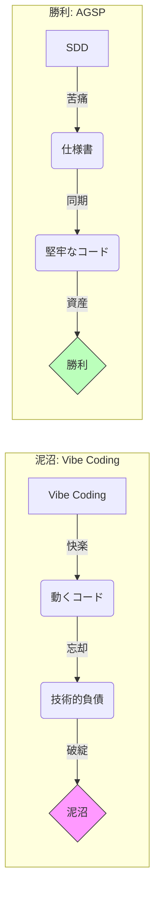

Vibe Codingは楽しい。だが、それは死に至る病だ。
SDD（仕様駆動）は面倒だ。最初にMarkdownを書かねばならない。苦痛を伴う。
だが、この苦痛こそが、未来の「勝利」への唯一の切符だ。

## 敗北宣言、そして再生へ

2026年、俺はキーボードを置く。
これ以上、自分の手でスパゲッティコードを量産するのはやめだ。

俺はコードを書くことをやめる。その代わり、**「仕様」を書く**。
AIという暴れ馬を乗りこなすための、冷徹な鞭を振るう。

これは、Vibe Codingの甘い罠に溺れ、一度は死んだ開発者の、破壊と再生の記録だ。
この泥沼から這い上がる覚悟はあるか？ あるならついて来い。

---

### 次回予告

孤独な戦場に、頼れる友はいない。だが、有能な「道具」はいる。
俺の脳、俺の手、そして俺の目。
それらをAIで代替し、組織化した時、ワンマンアーミーは軍隊となる。

次回、「参謀本部」。
脳内に飼う4人の怪物について語ろう。

**(続く)**

---

# 第2回：参謀本部 (Headquarters)

<b>" 悪い将軍が一人いる方が、良い将軍が二人いるよりマシだ。 "</b>

— ナポレオン・ボナパルト —

## 孤独な開発？ 笑わせるな。

俺のブラウザには世界最強の軍団が待機している。
全てを記憶する作戦局長Gemini。論理の鬼、設計局長Claude。そして前線を支えるAIエージェントたち。
彼らはただのチャットボットではない。俺の軍隊だ。

だが、指揮系統のない軍隊は烏合の衆に過ぎない。
「Geminiでアイデアを出し、Claudeで書く」。そんな曖昧な運用では、いつか友軍撃ち（Friendly Fire）で死ぬ。
だから俺は**AGSP（AI参謀本部プロトコル）**を敷いた。

命令系統を一本化せよ。人間はただ一人、決断するだけでいい。

## 組織図：4人の怪物たち

俺の脳内参謀本部を可視化するとこうなる。

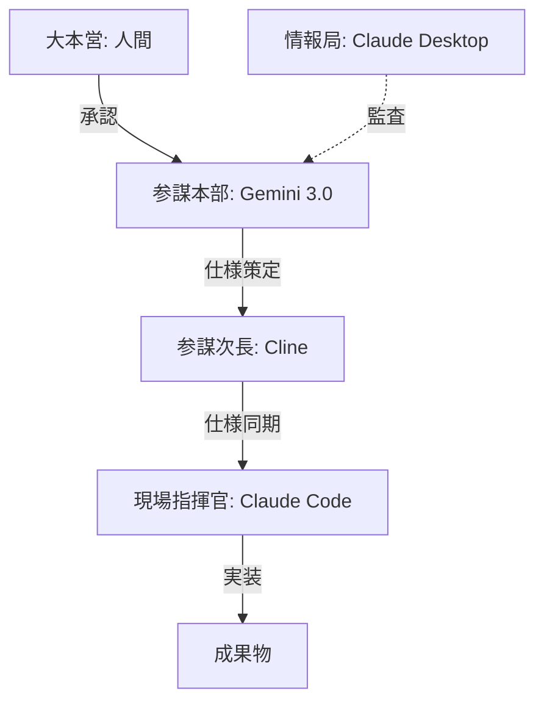

1. **大本営 (Gemini 3.0)**: 戦略を決める。コードは書かない。
2. **参謀次長 (Cline)**: 仕様書（Markdown）を書く。ファイルを管理する。
3. **現場指揮官 (Claude Code)**: コードを書く。爆速で実装する。
4. **情報局 (Claude Desktop)**: 監視する。現状を報告する。

役割を混ぜるな。思考する者が手を動かしてはならないし、手を動かす者が勝手に考えてはならない。
それが鉄の規律だ。

---

### 次回予告

脳と手。二つの世界は分断されている。
それを繋ぐのは、血管か、神経か、あるいはMarkdownか。
次回、「第二の脳」。記憶を外部化せよ。

---

# 第3回：第二の脳 (Second Brain)

<b>" 淡き墨は、強き記憶に勝る。 "</b>

— 中国の諺 —

## 忘却という名の敵

ブラウザの「参謀本部」と、ローカルの「実行部隊」。二つの世界は分断されていた。
昨日Geminiと話した素晴らしいアイデアを、今日のClaudeは知らない。
人間もまた、自ら書いた設定を忘れる。

コピペなどという惰弱な作業は捨てろ。リアルタイム同期こそが、この機械仕掛けの軍隊を動かす心臓だ。
忘却を恐れるな。全てはそこに記されている。

## Single Source of Truth

真実はどこにある？ チャット履歴か？ コードか？
違う。**Google Drive（ドキュメント）**だ。

俺はAGSPにおいて、Drive上のMarkdownファイルを「正本」と定義した。
PCのローカルフォルダをDriveと同期させる。それだけだ。
だが、この単純なパイプラインが戦局を変える。

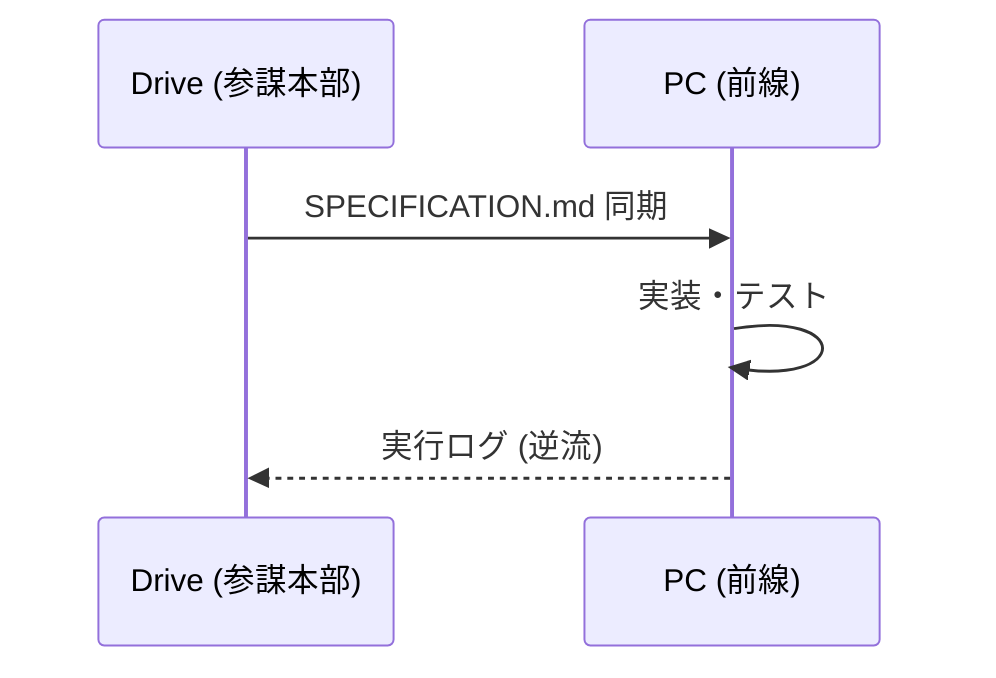

Geminiが空で仕様書を更新すれば、地上でClaudeが走り出す。
この「ドキュメント駆動（DocDD）」こそが、ワンマンアーミーの兵站線だ。

---

### 次回予告

壮大な戦略も、兵站がなければ画餅に帰す。
前線に物資を運び、作業を細切れにする冷徹な管理官。
次回、「参謀次長」。タスクという名の弾薬箱について。

---

# 第4回：参謀次長 (Chief of Staff)

<b>" 素人は戦略を語り、プロは兵站を語る。 "</b>

— オマール・ブラッドレー —

## 巨大な作戦を解体せよ

「HAKONIWAを作れ」。そんな命令で動けるのは神だけだ。
巨大な作戦も、分解すればただの作業だ。だが、その順序を間違えれば部隊は全滅する。

参謀次長 **Cline**。VS Codeに住まうこの怪物は、Gemini 1.5 Proの200万トークンという巨大な脳を使って、プロジェクト全体を俯瞰する。
こいつの仕事はコードを書くことじゃない。「30分で終わるタスク」に解体することだ。

## 兵站を制する者が開発を制す

各タスクには完了条件（BDD）が付与される。迷う隙など与えない。ただ、遂行あるのみ。

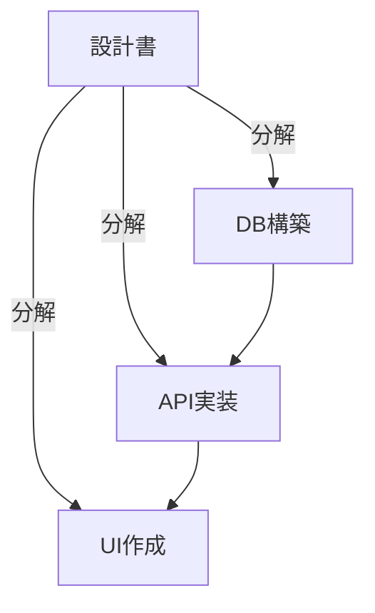

「1タスク1プルリクエスト」。これがAGSPの行軍速度だ。
コンテキストが溢れる前にコミットする。そのリズムを作るのが、参謀次長の仕事だ。

---

### 次回予告

「なんとなく作ってくれ」。そんな甘えは戦場では死を意味する。
欲望を言葉に、言葉を鋼鉄の仕様に変えろ。
次回、「作戦命令」。Geminiが導く"WHAT"の世界。

---

# 第5回：作戦命令 (Operation Order)

<b>" 命令は、誰にでも理解できる簡潔な言葉で下されなければならない。 "</b>

— アンリ・ド・ミニエール —

## 曖昧な命令は死を招く

Gemini 3.0 Pro。こいつにプロジェクトの全歴史を読ませろ。そして吐き出させろ。
「何を作るか（WHAT）」と「なぜ作るか（WHY）」。
技術論（HOW）は要らない。必要なのは、揺るぎない作戦目的だ。

曖昧な命令書は、部下（AI）を殺す。貴官の言葉一つが、システム全体の命運を握っている。
書け。血を吐く思いで、仕様を定義せよ。

## WHATの定義

Vibe Codingからの脱却は、ここから始まる。
俺たちはコードを書くのではない。「仕様書（SPECIFICATION.md）」を書くのだ。

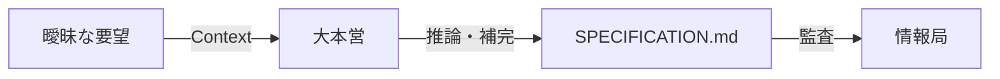

「ユーザーがログインできること」。それだけでは不十分だ。
「トークン切れの際の挙動は？」「エラー時のメッセージは？」
Geminiと議論し、その全てをMarkdownに焼き付ける。それが終わるまで、一行たりともコードを書かせてはならない。

---

### 次回予告

命令は下った。だが、どうやって実現する？
机上の空論を、動く現実へと変換する暴力的なまでの論理。
次回、「現場指揮官」。重装甲部隊が動き出す。

---

# 第6回：現場指揮官 (Field Commander)

<b>" 今、激しく実行される良い計画は、来週の完璧な計画に勝る。 "</b>

— ジョージ・パットン —

## 思考停止という名の武器

議論は終わった。ここからは実戦（コーディング）だ。だが、俺は撃たない。
ターミナルで `claude implement` と打つだけだ。

現場指揮官 **Claude Code**。最高知能を積んだ重戦車が、バグの海を突き進む。
奴に「なぜ？」と問うてはならない。奴は仕様書というレールの上を、光速で走るためだけに存在している。

## 一撃必殺の実装

「トライ＆エラー」などという甘えを捨てろ。
テストファースト。仕様を満たすテストを書き、それが通るまで自らを修正し続ける自律ループ。

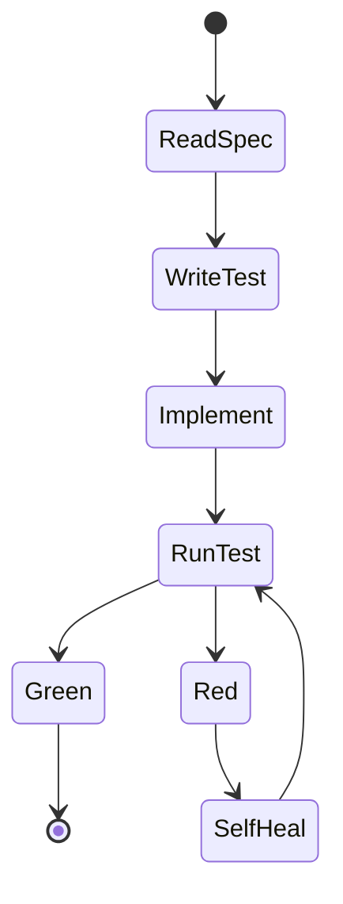

俺がコーヒーを飲んでいる間に、機能は実装されている。
これがAGSPの火力だ。

---

### 次回予告

現場は生き物だ。仕様は常に裏切られる。
だが、コードだけ直して満足するな。それは破滅への第一歩だ。
次回、「逆流同期」。現場の血を、上流へ書き戻せ。

---

# 第7回：逆流同期 (Reverse Sync)

<b>" 我々の直面する重要な問題は、それを作った時と同じ思考レベルでは解決できない。 "</b>

— アルベルト・アインシュタイン —

## 影を斬っても実体は死なない

「現場で仕様が変わった」。よくある話だ。
実装中に矛盾が見つかる。エラーが出る。
ここで多くの兵士は過ちを犯す。その場のコードを書き換えて、エラーを消してしまうのだ。

それは「死」への第一歩だ。
コードは仕様の影に過ぎない。影をどれだけ弄っても、実体（仕様書）が間違っていれば、次の生成でまたバグが復活する。

## ドリフトを許すな

逆流同期（Reverse Sync）。
現場で起きた不整合は、必ず参謀本部へ持ち帰れ。

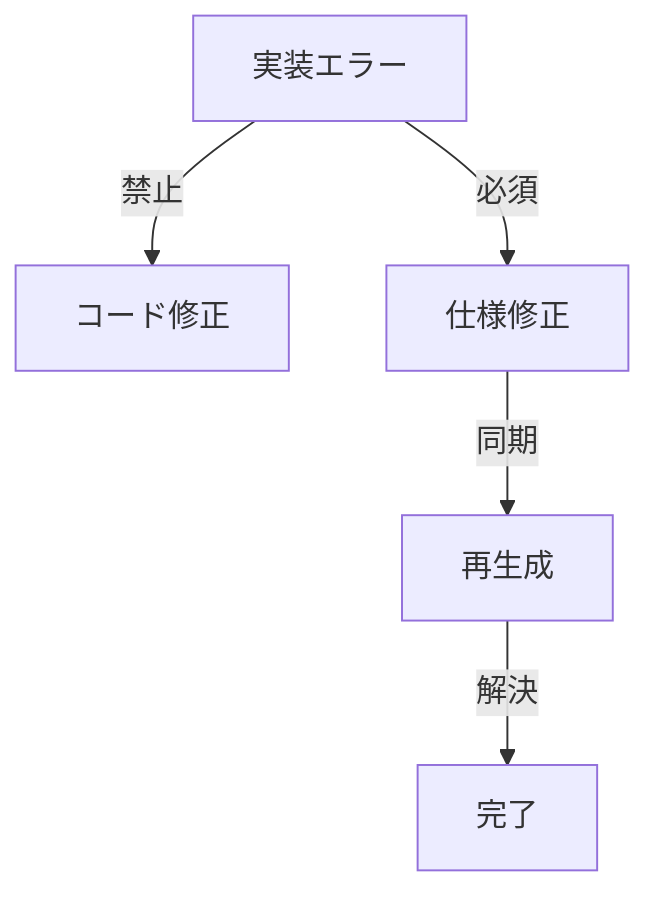

エラーログをコピーし、Geminiに叩きつける。「貴様の書いた仕様書が間違っていた」と。
仕様書を修正し、再生成する。
遠回りに見えるか？ だが、これだけが「技術的負債」という名の泥沼から足を洗う唯一の方法だ。

---

### 次回予告

AIは優秀だ。だが、奴らは平気で嘘をつく。
暴走を許すな。過去の経緯とルールが、奴らの首輪になる。
次回、「人格維持」。プロジェクト憲法の番人。

---

# 第8回：人格維持 (Identity)

<b>" 人は同じ川に二度入ることはできない。 "</b>

— ヘラクレイトス —

## 記憶は揮発する

プロジェクトが進めば、AIの記憶（コンテキスト）は薄れ、規律は緩む。
AyuがYanaのような口調になり、ハードボイルドなブログがいつの間にか「ですます調」になる。
それがLLMの宿命だ。

だからこそ「憲兵」が必要だ。
奴は過去の経緯とルールをすべて記憶している。
仕様書が上がってくるたび、奴の冷徹な目が光る。「それは憲法違反だ」と。

## Steering & Rules

プロジェクトには**「憲法（Rules.md）」**が必要だ。
「口調」「コーディング規約」「禁止事項」。
これを毎回プロンプトに注入するのではない。情報局（Claude Desktop）に監視させるのだ。

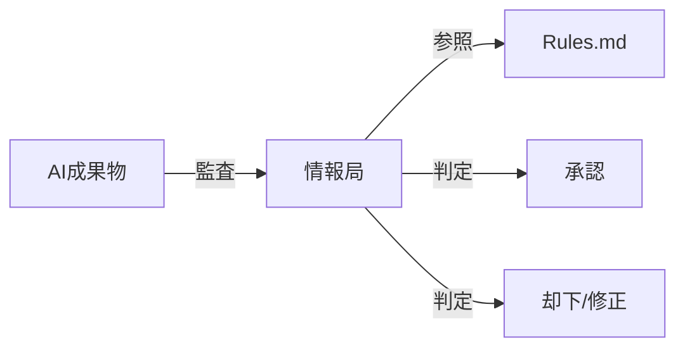

設定とは、魂の定義だ。それを守れぬ者に、世界を作る資格はない。

---

### 次回予告

武器を選べ。錆びたナイフでは戦えない。
クラウドの知能を、ローカルの端末に宿すための儀式。
次回、「局地戦用兵器」。Spec Kitと環境構築。

---

# 第9回：局地戦用兵器 (Local Weapons)

<b>" 役に立たない武器などない。役に立たない使い手がいるだけだ。 "</b>

— 宮本武蔵 —

## 泥臭い塹壕戦

戦場はきらびやかなWebブラウザだけではない。泥臭いローカル環境こそが、俺たちの塹壕だ。
GitHub Spec Kit。Claude Code。Cline。
これらは単なるツールではない。生存のための武器だ。

環境を研ぎ澄ませ。`.clinerules` の一行、`.clauderc` の設定一つが、生死を分けることもある。
使いこなせなければ、ただの鉄屑だ。

## ツールチェーンの整備

AIエージェントが最大限の能力を発揮するためのディレクトリ構成。
「ドキュメントは `docs/` に」「ソースは `src/` に」。
当たり前のことを、当たり前に整備する。

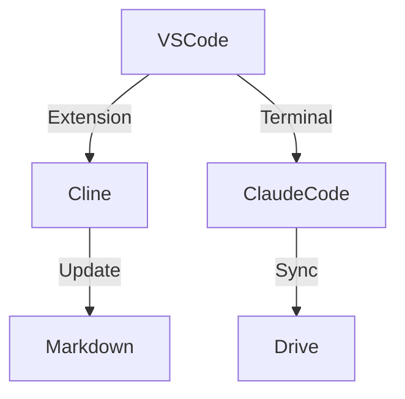

クラウドの知能（Gemini）を、ローカルの手足（Claude）に直結するパイプライン。
それが完成した時、PCはただの箱から「要塞」へと変わる。

---

### 次回予告

一匹狼にレビューしてくれる同僚はいない。だが、甘えは許されない。
コミット直前、俺はコードを参謀本部に突き出す。「これを監査せよ」。
次回、「強制執行」。孤独な品質保証の儀式。

---

# 第10回：強制執行 (Enforcement)

<b>" 騙すな、騙されるな "</b>

— デュナン・ナッツ（漫画『アップルシード』3巻） —

## 疑うこと、それがレビューだ

「AIがやったから大丈夫だ」。その慢心が命取りだ。
奴らはもっともらしい顔で、致命的な嘘をつく。幻覚（ハルシネーション）を見る。
だから俺は、コミット直前に「多重尋問」を行う。

かつて親父（カール・ナッツ）は言った。「騙すな、騙されるな」と。
自分自身を騙すな（正常性バイアス）。AIに騙されるな（検証不足）。
これがAGSPにおける品質保証の鉄則だ。

## 自動化された審問

実装したAI（被告）と、レビューするAI（検察）を分けろ。
同じAIに自己採点させるな。

### 多重チェックシステム

Roo Codeの「監査モード」や、Devinによる自動レビュー。
規約、設計、要件。この審問を潜り抜けたコードだけが、世界に出ることを許される。

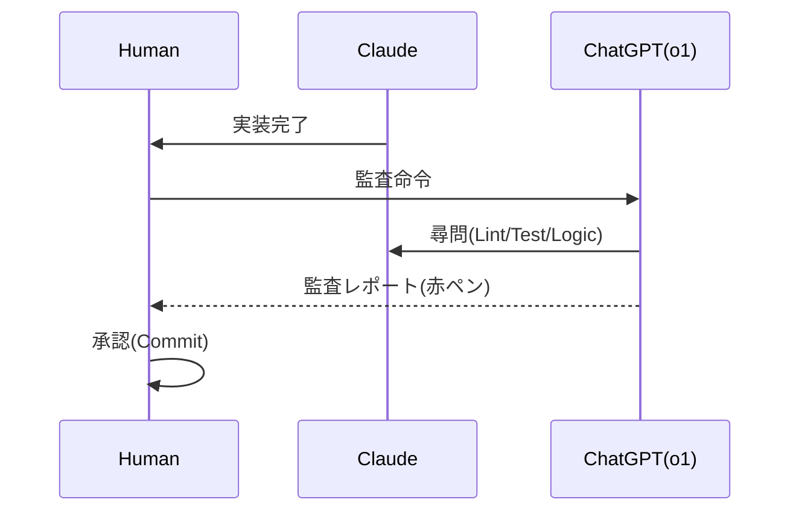

孤独な開発者に必要なのは、甘い言葉ではない。冷徹な指摘だ。
「騙されない」ための仕組みを、システムの中に組み込め。

---

### 次回予告

終わりなき戦い。システムは生き続け、変わり続ける。
最強の者などいない。適応する者だけが生き残る。
次回、「無限回路」。開発という名の螺旋階段。

---

# 第11回：無限回路 (Infinite Loop)

<b>" 最も強い者が生き残るのではない。最も変化に適応できる者が生き残るのだ。 "</b>

— チャールズ・ダーウィン —

## 永遠のβ版

システムは完成した。だが、それは終わりではない。始まりに過ぎない。
新たな要望、環境の変化、技術の陳腐化。敵は次々と現れる。
仕様を更新し、コードを捨て、また作る。この無限のループこそが、俺たちの日常だ。

止まるな。止まれば錆びつく。走り続けろ。

## 螺旋的進化

仕様変更を恐れるな。AGSPにおいては、仕様変更こそがエネルギーだ。
仕様が変われば、テストが変わり、コードが変わる。
CI/CDパイプラインがそれを自動で回し続ける。

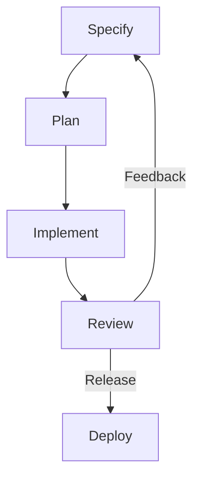

俺たちは、このサイクルを回すための「最初のひと押し」をするだけでいい。
あとはシステムが自律的に進化していく。

---

### 次回予告

コードを書く時代は終わった。俺たちは失業したのか？
いや、違う。俺たちは「設計」という本来の戦場へ戻るのだ。
次回、最終回。「総監督」。インテント・アーキテクトの誕生。

---

# 第12回：総監督 (The Director)

<b>" 戦争は、他の手段をもってする政治の継続である。 "</b>

— カール・フォン・クラウゼヴィッツ —

## 硝煙の彼方に

硝煙は晴れた。キーボードの音も止んだ。
コードを書く作業員としての俺は死んだ。だが、ここに新生した俺がいる。

「何を作るか（Intent）」を定義し、化け物たちを従える能力。
**インテント・アーキテクト（Intent Architect）**。それが俺たちの新しい名前だ。

## 孤独の先に見る景色

かつて俺は、エラーログに怯える孤独な兵士だった。
だが今は、4人の強力な参謀たちと共に、摩天楼を見下ろしている。

コードを書くな。仕様を書け。
技術に溺れるな。目的を見ろ。
AGSP。それは俺たちを、作業員から指揮官へと進化させるための翼だ。

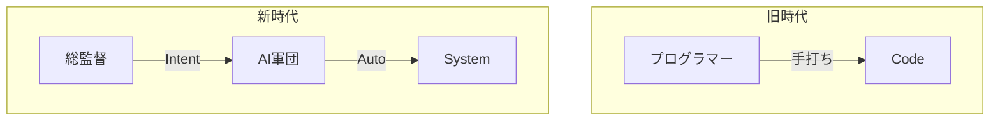

仕様という名の弾丸を込めろ。次の戦場が待っている。

**(完)**