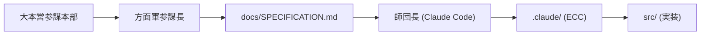
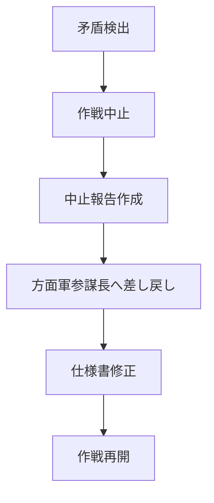

# AGSP × Everything-Claude-Code Integration Protocol

**"Spec-Driven Strategy meets Agentic TDD Tactics."**

本プロトコルは、AGSP（AI参謀本部プロトコル）v2.0 と Everything-Claude-Code (ECC) の統合運用規定である。

---

## 1. 概要 (Overview)

| レイヤー | 管轄 | 責任 |
|----------|------|------|
| 戦略・仕様 | AGSP（大本営・方面軍） | `docs/SPECIFICATION.md` |
| 戦術・実装 | ECC（師団長） | `.claude/` 配下 |



---

## 2. 師団長の権限と責任 (Division Commander Authority)

### 2.1 作戦開始の最終判断権

師団長（Claude Code）は、仕様書を査閲した上で作戦開始の可否を**自ら判断する権限**を有する。

**開始前チェックリスト**:

```markdown
## 作戦開始判断
- [ ] 仕様書が完全に読み込まれた
- [ ] 全ての要件が明確である
- [ ] 技術的に実現可能である
- [ ] 必要な依存関係が揃っている
- [ ] テスト計画が明確である

→ 全てチェック: 作戦開始
→ 未チェック項目あり: 差し戻し
```

### 2.2 作戦中止の最終判断権

以下の状況では、師団長は**独断で作戦を中止**し、方面軍参謀長へ差し戻す：

1. **仕様の矛盾**: 論理的に両立しない要件を発見
2. **技術的障壁**: 現行技術では実現不可能
3. **リソース不足**: 必要なツール・ライブラリが不足
4. **安全性懸念**: セキュリティリスクを検出

**中止報告テンプレート**:

```markdown
## 作戦中止報告
- **作戦名**: [プロジェクト名/機能名]
- **中止理由**: [矛盾/障壁/不足/懸念]
- **該当箇所**: SPECIFICATION.md §[セクション番号]
- **詳細**: [具体的な問題点]
- **提案**: [解決策（あれば）]
```

---

## 3. ECC 導入手順 (Installation)

### Step 1: ECC の配備

```bash
# Everything-Claude-Code リポジトリをクローン
git clone https://github.com/affaan-m/everything-claude-code.git /tmp/ecc

# 必要なディレクトリをコピー
cp -r /tmp/ecc/.claude ./

# 一時ディレクトリを削除
rm -rf /tmp/ecc
```

### Step 2: AGSP 適合パッチ

`.claude/rules/agsp-compliance.md` を作成：

```markdown
# AGSP Compliance Rule

## 仕様書遵守
- Implementation Source of Truth: `docs/SPECIFICATION.md`
- Do NOT improvise features not described in the specification.
- If specification is unclear, STOP and escalate to 方面軍参謀長.

## 作戦判断権
- You have the authority to START or STOP operations.
- Exercise this authority responsibly based on specification feasibility.

## 目視確認対応
- When 幕僚長 requests visual inspection, respond promptly.
- Provide: execution demos, logs, or screenshots as requested.
```

---

## 4. 実戦ワークフロー (Combat Workflow)

### Phase 1: 仕様書の査閲

```bash
# 師団長が仕様書を確認
cat docs/SPECIFICATION.md

# 作戦開始判断を実施
```

### Phase 2: TDDサイクル

ECCの `/tdd` コマンドを使用：

```bash
claude -p "/tdd Implement REQ-001 as defined in docs/SPECIFICATION.md §2.1"
```

**TDDサイクル (Red-Green-Refactor)**:

1. **RED**: 仕様に基づき失敗するテストを書く
2. **GREEN**: テストを通す最小限の実装
3. **REFACTOR**: コードを清書

### Phase 3: 監査

```bash
claude -p "/code-review"
claude -p "/security-audit"
```

---

## 5. 目視確認対応 (Visual Inspection Response)

幕僚長（User）から目視確認要求を受けた場合：

### 5.1 実行デモンストレーション

```bash
# 要求された機能を実行
python main.py --demo

# 結果を報告
```

### 5.2 実行ログの提示

```bash
# テスト実行ログ
pytest tests/ -v 2>&1 | tee test_results.log

# ログを報告
cat test_results.log
```

### 5.3 スクリーンショット

```bash
# 画面キャプチャ（環境に応じて）
# Linux: gnome-screenshot -f screenshot.png
# macOS: screencapture screenshot.png
# Windows: (PowerShell) Add-Type -AssemblyName System.Windows.Forms; [System.Windows.Forms.Screen]::PrimaryScreen | ...

# ファイルを報告
```

---

## 6. 差し戻しプロトコル (Drift Control)

TDDサイクル中に仕様の矛盾を検出した場合：



1. **STOP**: 実装を即時中断
2. **REPORT**: 中止報告を作成
3. **ESCALATE**: 方面軍参謀長へ差し戻し
4. **WAIT**: 仕様書修正を待機
5. **RESTART**: `/tdd` を再実行

---

## 7. ECC Agent 一覧

| Agent | 用途 |
|-------|------|
| `tdd-guide` | TDDサイクルの実践 |
| `/tdd` | Red-Green-Refactor コマンド |
| `/code-review` | コードレビュー |
| `/security-audit` | セキュリティ監査 |

---

## 8. AGSP v2.0 との整合性

| AGSP 規定 | ECC 対応 |
|-----------|----------|
| 師団長の作戦開始判断権 | 仕様書査閲後に自律判断 |
| 師団長の作戦中止判断権 | 矛盾検出時に即時中止 |
| 目視確認規定 | 実行デモ/ログ/SS対応 |
| Reverse Sync | 差し戻しプロトコル |

---

*AGSP v2.0 × Everything-Claude-Code Integration Protocol*
